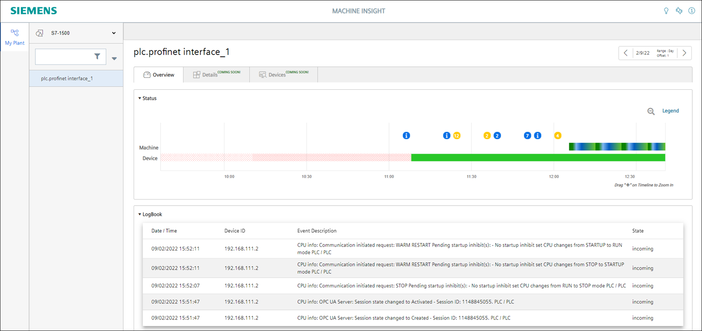

# Configuration

- [Configuration](#configuration)
  - [Configure layer 2 access on IED](#configure-layer-2-access-on-IED)
  - [Configure PLC Connection](#configure-plc-connection)
    - [Configure Databus](#configure-databus)
    - [Configure S7 Connector](#configure-s7-connector)
  - [Configure Machine Insight](#configure-machine-insight)
    - [Configure Machine Insight Configurator](#configure-machine-insight-configurator)
    - [Configure Machine Insight Overview](#configure-maschine-insight-overview)

## Configuration

To run the Machine Insight application, all the following applications must be deployed and configured in **the same IED**:
- Device Scanner Service (for scan functionality)
- IE Databus (for machine status feature)
- S7 Connector (for machine status feature)
- Machine Insight Configurator
- Machine Insight

## Configure layer 2 access on IED

The device scanner requires a **layer 2 access** on the IED to enable the scanner of the devices in the Machine Insight.

To configure the layer 2 access, open the UI of the IED and in the menu go to Settings > Connectivity > LAN Network. For the network interface, that is connected to the PLC, the layer 2 access must be configured. Click the corresponding edit icon for that interface and add the needed.

## Configure PLC Connection

To read data from the PLC and provide the data, we will use S7 Connector to establish connection with the PLC via OPC UA.

The S7 Connector sends the data to the Databus, where the Data Service app can collect what is needed.

In order to build this infrastructure, these apps must be configured properly:

- Databus
- S7 Connector

### Configure Databus

In your IEM open the Databus and launch the configurator.

Add a user with this topic:
`"ie/#"`

Deploy the configuration.

### Configure S7 Connector

In your IEM open the S7 Connector and launch the configurator.

Add a data source:

Add needed tags:

Edit the settings:

Hint: Username and password should be the same for all system apps, e.g. "edge" / "edge".

Deploy and start the project.

## Configure Machine Insight

In your IED Web UI open the app Machine Insight Configurator.

Hint: Before the Machine Insight can be configured, the Device Scanner must be installed on the IED.

### Configure Machine Insight Configurator

Click "Add New Device" at the top of the left side.

Click on "Scan and Add" to automatically scan the network and see all devices on the network.

If you are looking for a specific device with name and IP, click on "Manually Add".

Enter the IP range in which the devices are to be searched.

Click on "Start Scan" and select the device on the left side by clicking on it.

To save, click on the "Save & Close" button at the bottom left.

Select a device and click on "Settings" at the top right.

To apply all settings, click on "Deploy" in the top right-hand corner.

To get to the Machine Insight view, click on "Go to App".

### Configure Machine Insight Overview

Select your device in the top left-hand corner to access the overview.

Here you can see the device status, notification icon and mapping status.

